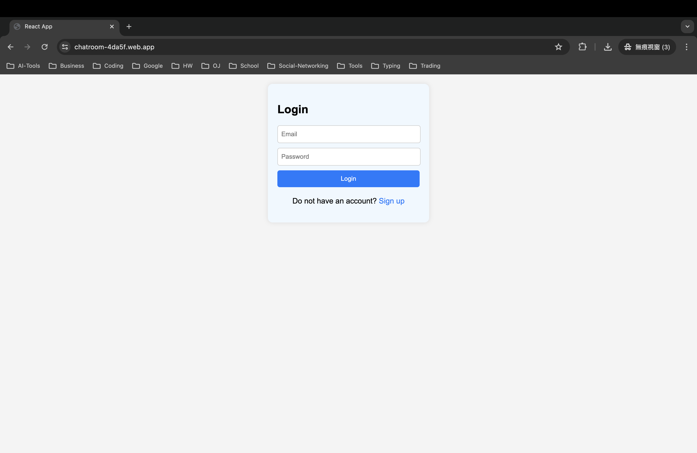
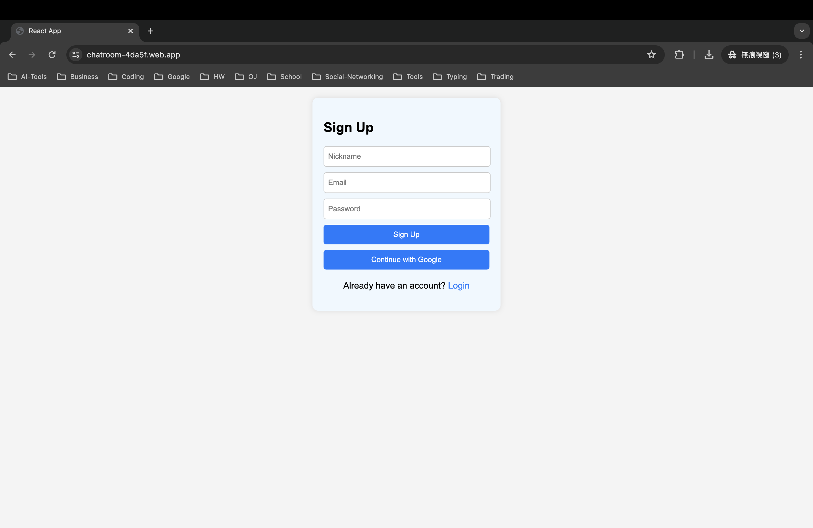
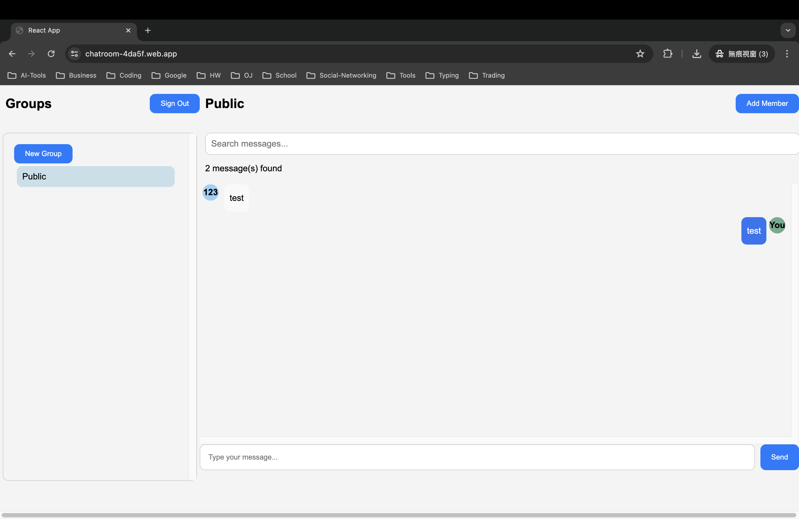
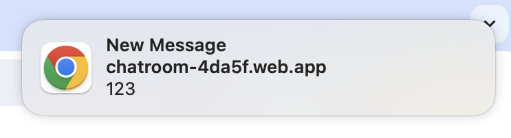
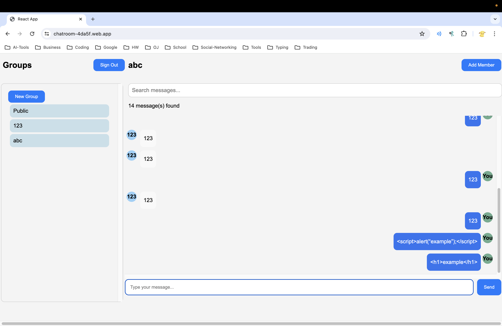
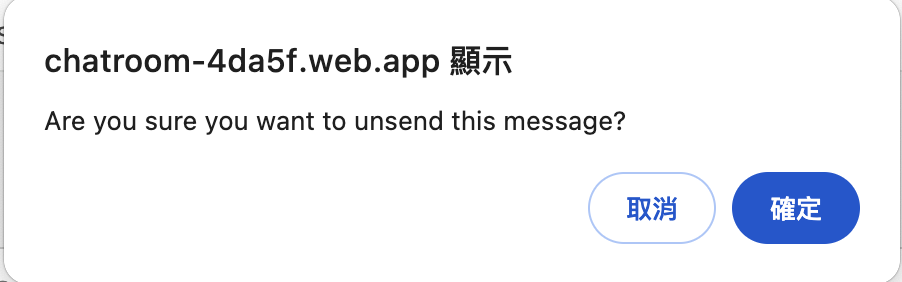
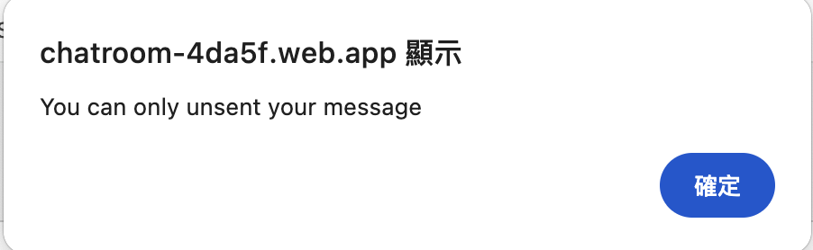
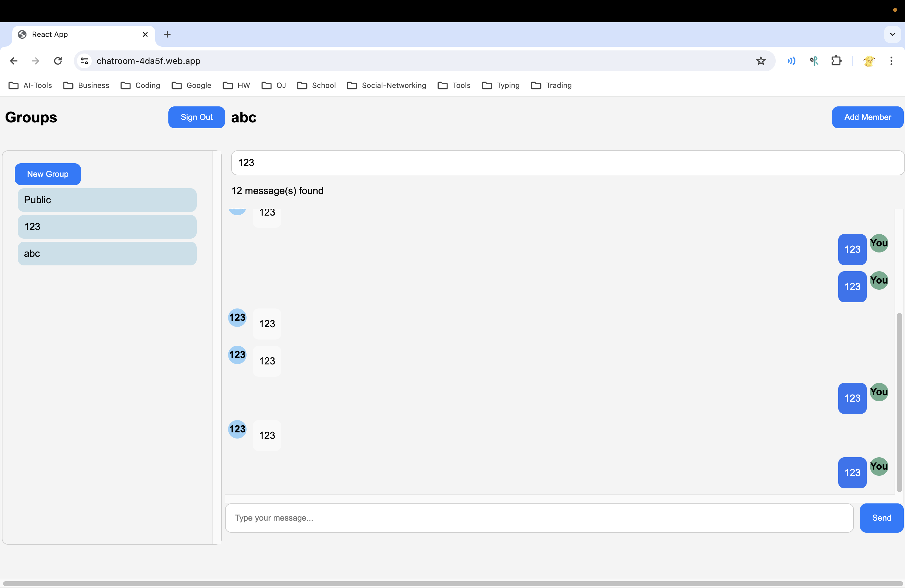

# Web Chatroom
This is "2024 Spring CS241002 Software Studio" course project at National Tsing Hua University (NTHU).

## Scoring

| **Basic Components**                             | **Score** | **Check** |
| :----------------------------------------------- | :-------: | :-------: |
| Membership Mechanism                             | 15%       | Y         |
| Firebase Page                                    | 5%        | Y         |
| Database Read/Write                              | 15%       | Y         |
| Responsive Design (RWD)                          | 15%       | Y         |
| Chatroom                                         | 20%       | Y         |

| **Advanced Tools**                               | **Score** | **Check** |
| :----------------------------------------------- | :-------: | :-------: |
| Using React                                      | 10%       | Y         |
| Third-Party Sign-In                              | 1%        | Y         |
| Notifications                                    | 5%        | Y         |
| CSS Animation                                    | 2%        | Y         |
| Security                                         | 2%        | Y         |

| **Other Useful Functions**                       | **Score** | **Check** |
| :----------------------------------------------- | :-------: | :-------: |
| Unsend Message                                   | 3%        | Y         |
| Search Message                                   | 3%        | Y         |

---

## How to Set Up Your Project

1. npx create-react-app `<chatroom-app>`
2. npm run build
3. npm start

## How to Use

### Login


- For registered users, enter your Email and Password, then click `Login`.
- For unregistered users, click `Sign up`.

### Sign-Up


- For new users, enter a Nickname, Email, and Password, then click `Sign Up`. You will be directed to the chatroom.
- To sign up using Google, click `Continue with Google`, and you will be taken to the chatroom.

### Chatroom


- **Left Side**: Group List
    - A `Sign Out` button is located at the top to log out.
    - The default group is Public.
    - Click `New Group` to create a new group by entering the group name in the pop-up.
- **Right Side**: Chatroom
    - Click `Add Member` to add members by entering their email. If successful, a message saying "Member added successfully" will appear; otherwise, "Member not found" will be shown. The added member will appear in the group after refreshing the page.
    - The current chatroom name is displayed.
    - Messages corresponding to the chatroom are shown.
    - There is a message input field at the bottom where you can type and send messages by clicking `Send`.

---

## Function Description

### Responsive Design (RWD)
- The layout maintains a 1:3 ratio for Group:Chatroom based on window width.
- If the width is less than 768px, the layout changes to a vertical stack with Group on top and Chatroom below.

### Chrome Notification


When a new message is received, a request to enable notifications will appear for the first time (Request Permission). If accepted, notifications will be enabled from then on.

### CSS Animation
- The Login and Sign-Up pages have fade-in and fade-out effects.
- Hovering over buttons (except `send`) will trigger a slight zoom-in effect (1.05x).

### Security


Scripts like `<script>alert("example");</script>` and HTML elements like `<h1>example</h1>` are safely handled.

### Unsend Message



- Double-click on your own message to prompt a confirmation box to unsend it.
- Double-clicking on someone else's message will show "You can only unsend your message."
- Once unsent, the change is reflected immediately (no need to refresh the page).

### Search Message


- Enter the message you want to search for (e.g., `searchMessage`) in the search box. It will filter the current chatroom and display only messages containing `searchMessage`.

---

## Firebase Page Link

- [Project URL](https://chatroom-4da5f.web.app/)

---

## Others (Optional)

### Files Hierarchy
```
chatroom-app/
│
├── public/
│   ├── index.html
│   └── ...
│
├── src/
│   ├── components/
│   │   ├── ChatRoom.css
│   │   ├── ChatRoom.js
│   │   ├── ChatInput.css
│   │   ├── ChatInput.js
│   │   ├── Groups.css
│   │   └── Groups.js
│   │
│   ├── context/
│   │   └── AuthContext.js
│   │
│   ├── pages/
│   │   ├── Home.css
│   │   ├── Home.js
│   │   ├── Login.css
│   │   ├── Login.js
│   │   ├── SignUp.css
│   │   └── SignUp.js
│   │
│   ├── App.css
│   ├── App.js
│   ├── firebase.js
│   ├── index.js
│   └── index.css
│
└── package.json
```

### Firebase Realtime Database Hierarchy
```
chatroom-app/
│
├── chatroom/
│   ├── Public/
│   │   └── msgList: []
│   │
│   ├── groupId/
│   │   ├── groupName: ""
│   │   ├── msgList: []
│   │   └── users: []
│   │
│   ├── groupId/
│   │   ├── groupName: ""
│   │   ├── msgList: []
│   │   └── users: []
│   │
│   └── ...
│
├── users/
│   ├── uid/
│   │   └── groups: ["Public", groupId...]
│   │
│   └── ...
│
└── ...
```